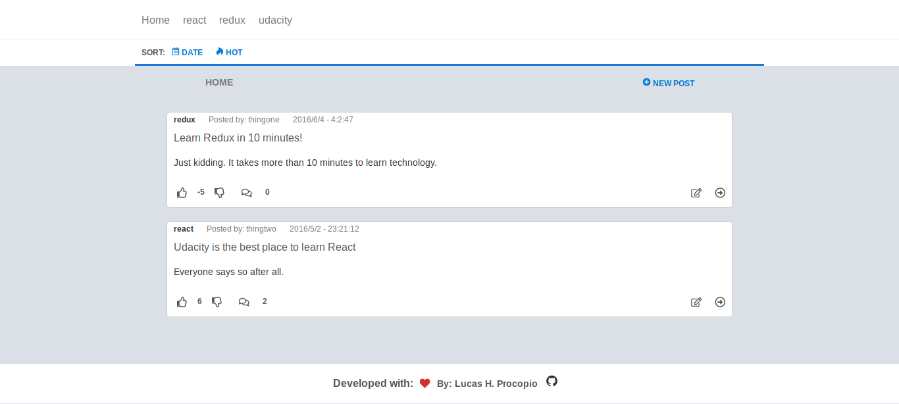

## React Discussion board

React Discussion Board is a discussion forum web app, for Udacity’s React
Nanodegree second project "Readable".
Users are able to post content to predefined categories, edit, delete, comment
on their posts and other users' posts and vote on posts and comments.

## 

## Live 
- click [here](https://lu-frontend-readable.herokuapp.com/) to preview :)

## Instalation

- Download or Clone the repository
- Enter the root folder of the app and run `npm install` or `yarn` to install
  all dependencies of the app.
- **NOTE** you will need the **backend** for this app, you can find it [here](https://github.com/udacity/reactnd-project-readable-starter)
  **make sure to follow the instructions to run it in you local machine**
- finally after you installed all dependencies and have the backend api server
  run `npm start` or `yarn start` in the root folder of this application

---
